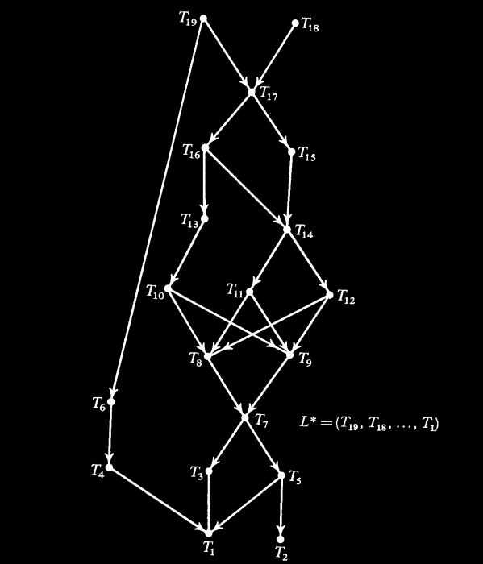
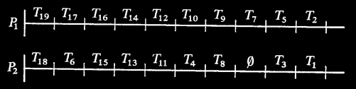
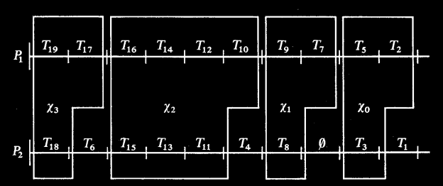

# 2 Processors Polynomial

## Sistema

Para $T, T' \in G$, diremos que $T$ es un **predecesor** de $T'$ y que $T'$ es un **sucesor** de $T$, si $T ≺ T'$. Además, si no existe tarea $T'' \in G$ tal que $T ≺ T'' ≺ T'$, entonces $T$ es un **predecesor inmediato** de $T'$ y $T'$ un **sucesor inmediato** de $T$. El conjunto de sucesores inmediatos de $T$ lo denotaremos como $S(T)$.

A cada sistema podemos asociarle un grafo dirigido $G$ cuyos vértices son el conjunto de tareas. Una arista desde el vértice $Ti$ hasta $Tj$ existirá si y solo si $Ti$ es un predecesor inmediato de $Tj$.

Consideremos schedules para un grafo $G$ según los cuales las tareas de $G$ son ejecutadas por $P_1$ y $P_2$ de la siguiente manera. Sea $L = (T_1, T_2, \dots, T_n)$ una permutación de las tareas de $G$. $L$ será llamado una lista para $G$. Inicialmente, en el tiempo $t = 0$, el procesador $P_1$ comienza a ejecutar la primera tarea en $L$ que no tiene predecesor. Decimos que una tarea $T$ está **lista** en el tiempo $t$ si en este momento todos sus predecesores (si existen) ya han sido ejecutados. En general, en cualquier momento, si un procesador $P_i$ está inactivo, escanea instantáneamente la lista $L$ y comienza a ejecutar la tarea lista $T_i$ con el mínimo $i$ que aún no ha comenzado a ejecutarse. Una vez que un procesador comienza a ejecutar una tarea $T$, continúa ejecutando a $T$ durante exactamente **una unidad de tiempo**, tras lo cual la ejecución de $T$ se completa. Es decir, se asume que todas las tareas en $G$ tienen el mismo tiempo de ejecución, y este se considera de longitud unitaria. Adoptamos la convención de que si tanto $P_1$ como $P_2$ intentan ejecutar simultáneamente la misma tarea, entonces esa tarea es ejecutada por $P_1$.

El algoritmo que presentamos en la siguiente sección tiene una complejidad temporal de $O(n^2)$, lo cual, en cierto sentido, es lo mejor posible, ya que en general son necesarios hasta $\frac{1}{4} n^2$ arcos para especificar un orden parcial.

## Algoritmo

Presentamos a continuación el algoritmo, llamado Algoritmo $A$, para construir la lista óptima $L^*$. Primero, necesitamos la siguiente definición.

Ordenamos linealmente las secuencias decrecientes de enteros positivos de la siguiente manera. Si $N = (n_1, n_2, \ldots, n_t)$ y $N' = (n'_1, n'_2, \ldots, n'_{t'})$ son secuencias decrecientes de enteros positivos (donde posiblemente $t = 0$), diremos que $N < N'$ si:

(i) Para algún $i \geq 1$, se cumple que $n_j = n'_j$ para todo $j$ que satisface $1 \leq j \leq i - 1$ y $n_i < n'_i$, o

(ii) $t < t'$ y $n_j = n'_j$ para $1 \leq j \leq t$.

Sea $r$ el número de tareas en $G$. El Algoritmo $A$ asigna a cada tarea $T$ un entero $\alpha(T) \in \{1, 2, \ldots, r\}$. La función $\alpha$ se define recursivamente de la siguiente manera:

(a) Se elige una tarea arbitraria $T_0$ con $S(T_0) = \emptyset$ y se define $\alpha(T_0)$ como 1.

(b) Supongamos que para algún $k \leq r$, los enteros $1, 2, \ldots, k - 1$ han sido asignados. Para cada tarea $T$ en la que $\alpha$ ha sido definida en todos los elementos de $S(T)$, sea $N(T)$ la secuencia decreciente de enteros formada al ordenar el conjunto $\{\alpha(T'): T' \in S(T)\}$. Al menos una de estas tareas $T^*$ debe satisfacer $N(T^*) \leq N(T)$ para todas las tareas $T$ de este tipo. Se elige una de estas $T^*$ y se define $\alpha(T^*)$ como $k$.

(c) Repetimos la asignación en (b) hasta que todas las tareas de $G$ hayan sido asignadas a algún entero.

Finalmente, la lista $L^*$ se define mediante el Algoritmo $A$ como $(U_r, U_{r-1}, \ldots, U_1)$, donde $\alpha(U_k) = k$ para $1 \leq k \leq r$.

En las siguientes imágenes se muestra un ejemplo de un grafo y una lista $L^*$ producida por el Algoritmo $A$. Nótese que existen muchas listas que satisfacen el Algoritmo $A$, ya que $S(T_8) = S(T_9)$, $S(T_{10}) = S(T_{11}) = S(T_{12})$, $S(T_3) = S(T_4)$, y $S(T_1) = S(T_2) = \emptyset$. El scheduling generado por $L^*$ también se muestra en la figura.

**Nota**: Las tareas han sido indexadas de forma tal que coinciden con el valor asignado por el algoritmo A.

## Demostración de optimalidad

Debido a los tiempos de ejecución unitarios, tanto $P_1$ como $P_2$ están disponibles para ejecutar tareas en los mismos tiempos. Supongamos que $P_1$ y $P_2$ están disponibles para ejecutar nuevas tareas en el tiempo $t$, y que $T$ es la tarea no ejecutada cuya etiqueta es la más alta entre las correspondientes a las tareas aún no ejecutadas en el tiempo $t$. Para todo $T'$ tal que $T' ≺ T$, el etiquetado producido por el Algoritmo $A$ es tal que $\alpha(T') > \alpha(T)$. Por lo tanto, en el tiempo $t$ todos los predecesores de $T$ deben haber sido ejecutados y $T$ está listo para ser ejecutada. Dado que, por la construcción de $L^*$, $P_1$ y $P_2$ siempre intentan ejecutar la tarea pendiente con la etiqueta más alta, y dado que $P_1$ asigna tareas antes que $P_2$ por convención, vemos que $T$ debe ser la tarea ejecutada por $P_1$ en el intervalo unitario que comienza en el tiempo $t$. Esto establece la siguiente propiedad, que presentamos en forma de lema para facilitar su referencia en la prueba de que $L^*$ es óptima.

### Lema 1

Definimos $\tau(T)$ como el entero no negativo que representa el tiempo en el que la tarea $T \in G$ comienza su ejecución en un scheduling correspondiente a la lista $L^*$ para $G$. Si $T$ es ejecutada por $P_1$ y $\tau(T) \leq \tau(T')$, con $T \neq T'$, entonces $\alpha(T) > \alpha(T')$.

De lo anterior también notamos que $P_1$ nunca está inactivo antes del tiempo $\omega(L^*)$. El resultado principal ahora sigue.

### Teorema 1

Para un grafo $G$ dado, $\omega(L^*) \leq \omega(L)$ para todas las listas $L$.

#### Demostración 

Comenzamos con algunas definiciones. Supongamos que las tareas de $G$ se ejecutan usando $L^*$. Si $P_2$ está inactivo desde el tiempo $t$ hasta el tiempo $t+1$, decimos que $P_2$ está ejecutando una tarea vacía $\emptyset$ y definimos $\alpha(\emptyset) = 0$. Definimos recursivamente las tareas $V_i$ y $W_i$ de la siguiente manera:

(i) $V_0$ se define como la tarea ejecutada por $P_1$ que satisface $\tau(V_0) = \omega(L^*) - 1$ (es decir, $V_0$ es la última tarea en ser ejecutada por $P_1$). De manera similar, $W_0$ se define como la tarea (posiblemente vacía) ejecutada por $P_2$ con $\tau(W_0) = \omega(L^*) - 1$.

(ii) En general, para $k \geq 1$, $W_k$ se define como la tarea (posiblemente vacía) $T$ para la cual $\alpha(T) < \alpha(V_{k-1})$, $\tau(T) < \tau(V_{k-1})$ y $\tau(T)$ es máximo. Se sigue del Lema 1 que $W_k$ debe ser ejecutada por $P_2$. $V_k$ se define como la tarea ejecutada por $P_1$ que satisface $\tau(V_k) = \tau(W_k)$.

Si $W_1$ no existe, entonces ningún procesador está inactivo antes del tiempo $\omega(L^*) - 1$ y $L^*$ es claramente óptima. Por lo tanto, podemos asumir que $W_1$ (y por lo tanto $V_1$) existe. Supongamos que solo podemos definir $W_i$ para $0 \leq i \leq m$. Definimos $\mathcal{X}_i$ como el conjunto de tareas $T$ que satisfacen $\tau(V_{i+1}) < \tau(T) \leq \tau(V_i)$ pero con $T \neq W_i$, $0 \leq i \leq m$. Dado que $V_{m+1}$ no existe, entonces $\mathcal{X}_m$ es el conjunto de tareas $T$ con $\tau(T) \leq \tau(V_m)$ y $T \neq W_m$.

Nótese que la cardinalidad de cada $\mathcal{X}_k$ es impar y podemos establecer $|\mathcal{X}_k| = 2n_k - 1$ para un entero positivo $n_k$, $0 \leq k \leq m$. Un ejemplo que ilustra las definiciones anteriores es proporcionado por el diagrama de Gantt de la siguiente imagen.

El núcleo de la demostración del teorema está contenido en el hecho de que, para $0 \leq k \leq m$, si $T \in \mathcal{X}_k$ y $T' \in \mathcal{X}_{k+1}$, entonces $T' ≺ T$. Para demostrarlo es necesario aplicar una doble inducción sobre $\tau(T)$ y $\tau(T')$ que omitiremos en este trabajo por motivos de simplicidad.

Asumiendo que, para $0 \leq k \leq m$, si $T \in \mathcal{X}_k$ y $T' \in \mathcal{X}_{k+1}$, entonces $T' ≺ T$, entonces lo que resta es un paso corto para una prueba del teorema. Para una lista arbitraria $L$, todas las tareas en $\mathcal{X}_{k+1}$ deben ejecutarse antes de que cualquier tarea en $\mathcal{X}_k$ pueda comenzar. Dado que $\mathcal{X}_{k+1}$ consiste en $2n_{k+1} - 1$ tareas, esto requerirá al menos $n_{k+1}$ unidades de tiempo. Así, ejecutar $G$ requerirá al menos $\sum_{k=0}^{m} n_k$ unidades de tiempo, sin importar qué lista $L$ se use. Dado que $\omega(L^*) = \sum_{k=0}^{m} n_k$ hemos demostrado $\omega(L) \geq \omega(L^*)$ y la prueba está completa.
