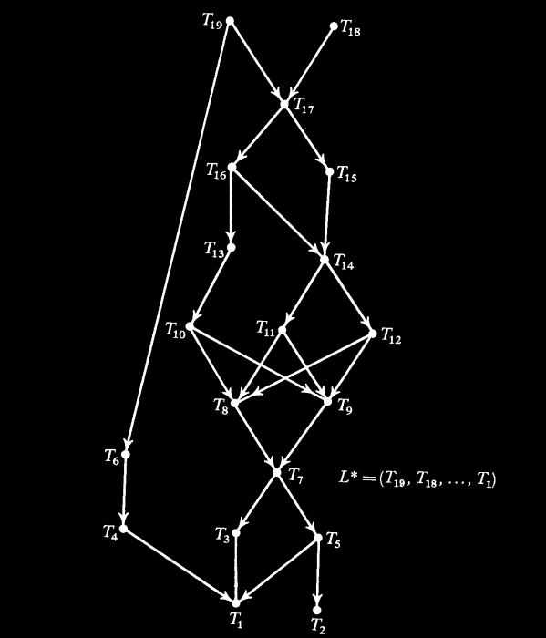
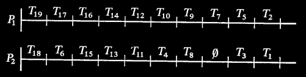
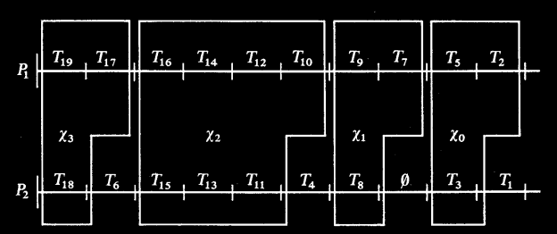

# Job Scheduling. Diseño y Análisis de Algoritmos

- Álbaro Suárez Valdés C-412
- Álvaro Luis González Brito C-412
- Javier Lima García C-412

## Definición del problema central (P0) (Job Scheduling)

Dados $n$ trabajos $J = \{j_1, j_2, ..., j_n\}$, un orden parcial $≺$ sobre $J$ (para realizar algunos trabajos, es necesario haber realizado otros previamente). Cada trabajo $i$ consiste en $s$ operaciones, $\{O_{i,1}, O_{i,2}, ..., O_{i,s}\}$ que deben ser procesadas por $m$ procesadores en ese orden. Es posible detener la ejecución de una operación, con un costo de tiempo $C_{i,j}$ para la operación $j$ del trabajo $i$. Cada operación posee un porcentaje de progreso por unidad de tiempo por procesador dado por $T_{i, j, k} \in \{1, 2, 3, ..., 100\}$ (porcentaje de progreso por unidad de tiempo de la operación $j$ del trabajo $i$ en el procesador $k$). Nótese que cada procesador puede procesar a lo sumo una operación a la vez. El objetivo es **acabar todos los trabajos en el menor tiempo posible**.

**Notas**: 
- Se asume que el tiempo es entero no negativo
- Ver *Anexos* para ejemplos de entrada y salida

### Motivaciones

Una solución al problema dado puede tener mucha utilidad en la práctica; dado que numerosos procesos computacionales pueden ser modelados de esta manera. Por ejemplo: un proceso compuesto por varios programas (*trabajos*) relacionados por un orden, que a su vez están compuestos por una cantidad finita y secuencial de instrucciones (*operaciones*), cada uno de los cuales debe ser ejecutado en un conjunto de computadoras (procesadores) y además existe el costo de hacer un cambio de contexto (*costo de interrupción*); puede darse el caso, incluso, que algunas instrucciones son ejecutadas de manera más eficiente en algunas computadoras que en otras.

## Análisis de Complejidad [1]

**Nota**: En esta sección trabajaremos con la versión de **"decisión"** de (P0), es decir, la versión en la que existe además un tiempo límite $t$ y la pregunta es: ¿es posible terminar todos los trabajos antes de $t$?.

Para analizar la complejidad temporal de (P0), enfoquémonos en los siguientes casos particulares.

### Definición (P1) (Tiempo de ejecución unitario)

Dada la definición de (P0), añadamos las siguientes restricciones:

- El porcentaje de progreso por unidad de tiempo es 100 para todas las operaciones por cada procesador ($T_{i, j, k} = 100, \space \forall i, j, k$). En otras palabras las operaciones tienen una *duración de una unidad de tiempo*, independientemente del procesador en la que sea ejecutada. De esta restricción podemos deducir que el costo de interrupción es despreciable.
- Todos los trabajos presentan solo una operación, $s_1 = s_2 = ... = s_n$.

### Definición (P2) (Tiempo de ejecución unitario con cantidad variable de procesadores)

Dada la definición de (P1), añadamos la restricción de que la cantidad de procesadores es variable con el tiempo, $c_0, c_1, ..., c_{t-1}$ tal que $\sum_{i = 0}^{t-1} c_i = n$, donde $c_i$ es la cantidad de procesadores en el instante $i$.

En lo que sigue asumimos que los problemas están codificados de tal forma que la longitud del string representativo de un problema de $n$ trabajos es polinomial en $n$ o al menos $O(n)$. Asumimos, además, que la codificación (encoding) es lo suficientemente natural para que los trabajos, la relación $≺$, etc, puedan ser determinados de manera sencilla y por supuesto en tiempo polinomial.

### Lema 1: (P2) se transforma polinomialmente en (P1)

#### Demostración:

Dada una instancia de (P2), introduzcamos nuevos trabajos $I_{ij}$ para $0 ≤ i < t$ y $0 ≤ j ≤ n - c_i$. Mantengamos a los antiguos trabajos relacionados por $≺$ y añadamos $I_{ij} ≺ I_{i-1, k}$ para $0 ≤ i < t - 1$ con $j$ y $k$ arbitrarios. Si seleccionamos $n + 1$ procesadores y un tiempo límite t, tenemos una instancia de (P1). 

##### Observación

*En cualquier solución, exactamente $n + 1 - c_i$ de los nuevos trabajos deben ser ejecutados en la iésima unidad de tiempo.*

Por motivos de contradicción, supongamos que las tareas $I_{kj}$ para un $k < t - 1$ y $0 ≤ j ≤ n - c_k$ son ejecutadas en la unidad de tiempo $k + 1$.

Sea $|{J_{k+1}, ..., J_{t-1}}| = p$, entonces tendremos que realizar un total de:

$\sum_{i = k + 1}^{t - 1} n + 1 - c_i = p (n + 1) + (c_{k+1}, ..., c_{t-1}) ≥ p(n + 1) - n = pn + p - n$

operaciones en:

$(p - 1)(n + 1) = pn + p - n - 1$

procesadores.

$pn + p - n - 1 < pn + p - n$, una **contradicción** (la cantidad de operaciones supera a la cantidad de procesadores)

∴ (P1) tiene una solución si y solo si la instancia original de (P2) tiene solución

Claramente la complejidad temporal de construir una instancia de (P1) es a los sumo cuadrática en la longitud de la representación de (P2). Luego, (P2) puede ser transformado polinomialmente en (P1)

■

### Lema 2: 3-SAT se reduce polinomialmente a (P2)

#### Demostración

Dada una instancia de 3-SAT con $m$ variables ($x_i, \space 1 ≤ i ≤ m$) y $n$ cláusulas ($Di, \space 1 ≤ i ≤ n$), construyamos la siguiente instancia de (P2).

Como trabajos:

- $x_{ij} \space$ y $\space \bar x_{ij}$ para $1 ≤ i ≤ m$ y $0 ≤ j ≤ m$
- $y_{i} \space$ y $\space \bar y_{i}$ para $1 ≤ i ≤ m$
- $D_{ij} \space$ para $\space 1 ≤ i ≤ n \space$ y $\space 1 ≤ j ≤ 7$

La relación $≺$ está dada por:

- $x_{ij} ≺ x_{i, j+1} \space$ y $\space \bar x_{ij} ≺ \bar x_{i, j+1}$, para $1 ≤ i ≤ m$ y $0 ≤ j ≤ m$

- $x_{i, i-1} ≺ y_{i} \space$ y $\space \bar x_{i, i-1} ≺ \bar y_{i}$, para $1 ≤ i ≤ m$

- Consideremos $D_{ij}$, donde $a_1a_2a_3$ constituye la representación binaria de $j$ (Notemos que el caso en el que $a_1 = a_2 = a_3 = 0$ no puede ocurrir). Además $D_i$ está formado por los literales $z_{k_1}, z_{k_2}, z_{k_3}$, donde cada $z$ representa de manera independiente a $x$ o $\bar x$, en un orden fijo. Entonces tenemos, para $1 ≤ p ≤ 3$, que $z_{k_p, m} ≺ D_{ij}$ si $a_p = 1$, o $\bar z_{k_p, m} ≺ D_{ij}$ si $a_p = 0$, donde $z$ representa a $\bar x$ or $x$, si $z$ representa a $x$ o $\bar x$, respectivamente.

El tiempo límite es $m + 3$, y las constantes $c_i, \space 0 ≤ i ≤ m + 2$ son:

- $c_0 = m$
- $c_1 = 2m + 1$
- $c_i = 2m + 2$, para $2 ≤ i ≤ m$
- $c_{m+1} = n + m + 1$
- $c_{m+2} = 6n$

Debemos demostrar que esta instancia de (P2) tiene solución si y solo si la instancia de 3-SAT tiene. La idea intuitiva detrás de la demostración está en que $x_i$ (o $\bar x_i$) es *true* si y solo si $x_{i0}$ (o $\bar x_{i0}$, respectivamente) es ejecutado en el instante 0. Notaremos que la presencia de los trabajos $y$'s y $\bar y$'s fuerzan a que exactamente uno de $x_{i0}$ y $\bar x_{i0}$ sea ejecutado en el instante 0 y el otro durante el instante 1. Luego, el requerimiento de que $n + m + 1$ trabajos sean ejecutados durante el instante $m + 1$ es equivalente al requerimiento de que por cada $i$, hay un $j$ tal que $D_{ij}$ puede ser ejecutado en ese instante (no puede haber más de uno). Pero esta condición es equiparable a decir que la cláusula $D_i$ tiene valor *true* cuando aquellos $x_i$'s y $\bar x_i$'s que fueron ejecutados en el instante 0 recibieron valor *true*.

Primero, demostremos que en cualquier solución de la instancia de (P2), no podemos ejecutar ambos $x_{i0}$ y $\bar x_{i0}$ en el instante 0 para cualquier $i$. Supongamos que sí. Entonces, dado que $c_0 = m$, existe un $j$ tal que ninguno de $x_{j0}$ y $\bar x_{j0}$ fue ejecutado en el instante 0. De ahí que ninguno de $y_j$ y $\bar y_j$ podrá ser ejecutado en o antes del instante j, debido a que $y_j$ debe ser precedido por $x_{j0}, x_{j1}, ..., x_{j, j-1}$, cada uno ejecutado de manera estricta a continuación del anterior. Luego el total de trabajos que pueden ser ejecutados en o antes del instante $j$ puede verse como:

- a lo sumo $m(2j + 1)$ de las $x$'s y $\bar x$'s, es decir, $z_{i0}, z_{i1}, ..., z_{ij}$ fueron ejecutados en el instante 0 y $z_{i0}, z_{i1}, ..., z_{i, j-1}$ si no (de nuevo z representa $x$ y $\bar x$)
- a lo sumo $2(j - 1)$ de los $y$'s, específicamente $y_1, \bar y_1, y_2, \bar y_2, ..., y_{j - 1}, \bar y_{j - 1}$

De ahí, tenemos, $2mj + 2j + m - 2$. Sin embargo, para $1 ≤ j ≤ m$,

$\sum_{i=0}^{j} c_i = 3m + 1 + (j - 1)(2m + 2) = 2mj + 2j + m - 1$ (**contradicción**)

Podemos, entonces, concluir, que en cualquier solución a esta instancia de (P2), exactamente uno de $x_{i0}$ y $\bar x_{i0}$ es ejecutado en el instante 0. Además, podemos determinar los trabajos exactos que son ejecutados en cada instante de tiempo entre 1 y m, dado cual de los dos, $x_{i0}$ o $\bar x_{i0}$ fue ejecutado en el instante 0. Dado que en el instante t tenemos que ejecutar $z_{it}$ si $z_{i0}$ fue ejecutado en el instante 0 y $z_{i, t-1}$ si no. Incluso, tenemos que ejecutar $y_t$ (respectivamente, $\bar y_t$) en el instante t si $x_{t0}$ (respectivamente, $\bar x_{t0}$) fue ejecutado en el instante 0 y ejecutar $y_{t - 1}$ (respectivamente, $\bar y_{t - 1}$) en el instante t si $x_{t0}$ (respectivamente, $\bar x_{t0}$) fue ejecutado en el instante 1.

En el instante $m + 1$ podemos ejecutar los m restantes $x$'s y $\bar x$'s y el restante $y$ o $\bar y$. Dado que $c_{m+1} = m + n + 1$, debemos ser capaces de ejecutar $n$ de los $D$'s si tenemos una solución. Observemos que por cada par $D_{ij}$ y  $D_{ij'}$, $j ≠ j'$, hay al menos un k tal que $x_km$ precede a $D_{ij}$ y $\bar x_km$ precede a $\bar D_{ij'}$, o viceversa. Como demostramos que exactamente uno de $x_km$ y $\bar x_km$ puede ser ejecutado en el instante m, se deduce que para cada i, a lo sumo uno de $D_{i1}, D_{i2}, ..., D_{i7}$ puede ser ejecutado en el instante $m + 1$.

Si asignamos el valor *true* a $x_k$, (respectivamente, $\bar x_k$) si y solo si $x_k0$ (respectivamente, $\bar x_k0$) fue ejecutado en el instante 0, entonces existirá uno de los $D_{i1}, D_{i2}, ..., D_{i7}$ ejecutable en el instante $m + 1$ si y solo si la cláusula toma valor *true* bajo esta asignación de las variables. 

Concluimos entonces que una solución a la instancia de (P2) existe si y solo si 3-SAT es satisfacible.

■

### Teorema 1: (P1) es NP-Completo

Por **Lema 1**, **Lema 2** y que 3SAT $\in$ NP-Completo 

■

### Corolario 1: (P0) es NP-Completo

Al ser (P1) un caso particular de (P0)

■

## Análisis de casos particulares

### Problema (P3) (Simple preemptive scheduling)

#### Definición

Dada la definición de (P0), añadamos las siguientes restricciones:

- $\forall i, j \space \exists p$ tal que $T_{i, j, k} = p, \space \forall k$. Es decir dada una operación su porcentaje de progreso por unidad de tiempo es el mismo para todos los procesadores
- Todos los trabajos presentan solo una operación, $s_1 = s_2 = ... = s_n$.
- El costo de interrupción es despreciable

#### Teorema 2: (P3) es NP-Completo

Notemos que (P1) es un caso particular de (P3) donde $p = 100$.

■

### Problema (P4) (Tiempo de ejecución unitario con solo dos procesadores) [2]

#### Definición

Dada la definición de (P1), añadamos la restricción de que la cantidad de procesadores es 2, $m = 2$.

Para $T, T' \in J$, diremos que $T$ es un **predecesor** de $T'$ y que $T'$ es un **sucesor** de $T$, si $T ≺ T'$. Además, si no existe tarea $T'' \in J$ tal que $T ≺ T'' ≺ T'$, entonces $T$ es un **predecesor inmediato** de $T'$ y $T'$ un **sucesor inmediato** de $T$. El conjunto de sucesores inmediatos de $T$ lo denotaremos como $S(T)$.

A cualquier instancia de (P0) podemos asociarle un grafo dirigido $G$ cuyos vértices son el conjunto de trabajos. Una arista desde el vértice $Ti$ hasta $Tj$ existirá si y solo si $Ti$ es un predecesor inmediato de $Tj$.

Consideremos schedules para un grafo $G$ según los cuales las tareas de $G$ son ejecutadas por $P_1$ y $P_2$ de la siguiente manera. Sea $L = (T_1, T_2, \dots, T_n)$ una permutación de las tareas de $G$. $L$ será llamado una lista para $G$. Inicialmente, en el tiempo $t = 0$, el procesador $P_1$ comienza a ejecutar la primera tarea en $L$ que no tiene predecesor. Decimos que una tarea $T$ está **lista** en el tiempo $t$ si en este momento todos sus predecesores (si existen) ya han sido ejecutados. En general, en cualquier momento, si un procesador $P_i$ está inactivo, escanea instantáneamente la lista $L$ y comienza a ejecutar la tarea lista $T_i$ con el mínimo $i$ que aún no ha comenzado a ejecutarse. Una vez que un procesador comienza a ejecutar una tarea $T$, continúa ejecutando a $T$ durante exactamente **una unidad de tiempo**, tras lo cual la ejecución de $T$ se completa. Es decir, se asume que todas las tareas en $G$ tienen el mismo tiempo de ejecución, y este se considera de longitud unitaria. Adoptamos la convención de que si tanto $P_1$ como $P_2$ intentan ejecutar simultáneamente la misma tarea, entonces esa tarea es ejecutada por $P_1$.

El algoritmo que presentamos a continuación tiene una complejidad temporal de $O(n^2)$, lo cual, en cierto sentido, es lo mejor posible, ya que en general son necesarios $O(n^2)$ arcos para especificar un orden parcial.

#### Algoritmo

Presentamos a continuación el algoritmo, llamado Algoritmo $A$, para construir la lista óptima $L^*$. Primero, necesitamos la siguiente definición.

Ordenamos linealmente las secuencias decrecientes de enteros positivos de la siguiente manera. Si $N = (n_1, n_2, \ldots, n_t)$ y $N' = (n'_1, n'_2, \ldots, n'_{t'})$ son secuencias decrecientes de enteros positivos (donde posiblemente $t = 0$), diremos que $N < N'$ si:

(i) Para algún $i \geq 1$, se cumple que $n_j = n'_j$ para todo $j$ que satisface $1 \leq j \leq i - 1$ y $n_i < n'_i$, o

(ii) $t < t'$ y $n_j = n'_j$ para $1 \leq j \leq t$.

Sea $r$ el número de tareas en $G$. El Algoritmo $A$ asigna a cada tarea $T$ un entero $\alpha(T) \in \{1, 2, \ldots, r\}$. La función $\alpha$ se define recursivamente de la siguiente manera:

(a) Se elige una tarea arbitraria $T_0$ con $S(T_0) = \emptyset$ y se define $\alpha(T_0)$ como 1.

(b) Supongamos que para algún $k \leq r$, los enteros $1, 2, \ldots, k - 1$ han sido asignados. Para cada tarea $T$ en la que $\alpha$ ha sido definida en todos los elementos de $S(T)$, sea $N(T)$ la secuencia decreciente de enteros formada al ordenar el conjunto $\{\alpha(T'): T' \in S(T)\}$. Al menos una de estas tareas $T^*$ debe satisfacer $N(T^*) \leq N(T)$ para todas las tareas $T$ de este tipo. Se elige una de estas $T^*$ y se define $\alpha(T^*)$ como $k$.

(c) Repetimos la asignación en (b) hasta que todas las tareas de $G$ hayan sido asignadas a algún entero.

Finalmente, la lista $L^*$ se define mediante el Algoritmo $A$ como $(U_r, U_{r-1}, \ldots, U_1)$, donde $\alpha(U_k) = k$ para $1 \leq k \leq r$.

En las siguientes imágenes se muestra un ejemplo de un grafo y una lista $L^*$ producida por el Algoritmo $A$. Nótese que existen muchas listas que satisfacen el Algoritmo $A$, ya que $S(T_8) = S(T_9)$, $S(T_{10}) = S(T_{11}) = S(T_{12})$, $S(T_3) = S(T_4)$, y $S(T_1) = S(T_2) = \emptyset$. El scheduling generado por $L^*$ también se muestra en la figura.



**Nota**: Las tareas han sido indexadas de forma tal que coinciden con el valor asignado por el algoritmo A.

##### Demostración de optimalidad

Debido a los tiempos de ejecución unitarios, tanto $P_1$ como $P_2$ están disponibles para ejecutar tareas en los mismos tiempos. Supongamos que $P_1$ y $P_2$ están disponibles para ejecutar nuevas tareas en el tiempo $t$, y que $T$ es la tarea no ejecutada cuya etiqueta es la más alta entre las correspondientes a las tareas aún no ejecutadas en el tiempo $t$. Para todo $T'$ tal que $T' ≺ T$, el etiquetado producido por el Algoritmo $A$ es tal que $\alpha(T') > \alpha(T)$. Por lo tanto, en el tiempo $t$ todos los predecesores de $T$ deben haber sido ejecutados y $T$ está listo para ser ejecutada. Dado que, por la construcción de $L^*$, $P_1$ y $P_2$ siempre intentan ejecutar la tarea pendiente con la etiqueta más alta, y dado que $P_1$ asigna tareas antes que $P_2$ por convención, vemos que $T$ debe ser la tarea ejecutada por $P_1$ en el intervalo unitario que comienza en el tiempo $t$. Esto establece la siguiente propiedad, que presentamos en forma de lema para facilitar su referencia en la prueba de que $L^*$ es óptima.

**Lema 3**

Definimos $\tau(T)$ como el entero no negativo que representa el tiempo en el que la tarea $T \in G$ comienza su ejecución en un scheduling correspondiente a la lista $L^*$ para $G$. Si $T$ es ejecutada por $P_1$ y $\tau(T) \leq \tau(T')$, con $T \neq T'$, entonces $\alpha(T) > \alpha(T')$.

De lo anterior también notamos que $P_1$ nunca está inactivo antes del tiempo $\omega(L^*)$. El resultado principal ahora sigue.

**Teorema 3**

Para un grafo $G$ dado, $\omega(L^*) \leq \omega(L)$ para todas las listas $L$.

**Demostración** 

Comenzamos con algunas definiciones. Supongamos que las tareas de $G$ se ejecutan usando $L^*$. Si $P_2$ está inactivo desde el tiempo $t$ hasta el tiempo $t+1$, decimos que $P_2$ está ejecutando una tarea vacía $\emptyset$ y definimos $\alpha(\emptyset) = 0$. Definimos recursivamente las tareas $V_i$ y $W_i$ de la siguiente manera:

(i) $V_0$ se define como la tarea ejecutada por $P_1$ que satisface $\tau(V_0) = \omega(L^*) - 1$ (es decir, $V_0$ es la última tarea en ser ejecutada por $P_1$). De manera similar, $W_0$ se define como la tarea (posiblemente vacía) ejecutada por $P_2$ con $\tau(W_0) = \omega(L^*) - 1$.

(ii) En general, para $k \geq 1$, $W_k$ se define como la tarea (posiblemente vacía) $T$ para la cual $\alpha(T) < \alpha(V_{k-1})$, $\tau(T) < \tau(V_{k-1})$ y $\tau(T)$ es máximo. Se sigue del Lema 1 que $W_k$ debe ser ejecutada por $P_2$. $V_k$ se define como la tarea ejecutada por $P_1$ que satisface $\tau(V_k) = \tau(W_k)$.

Si $W_1$ no existe, entonces ningún procesador está inactivo antes del tiempo $\omega(L^*) - 1$ y $L^*$ es claramente óptima. Por lo tanto, podemos asumir que $W_1$ (y por lo tanto $V_1$) existe. Supongamos que solo podemos definir $W_i$ para $0 \leq i \leq m$. Definimos $\mathcal{X}_i$ como el conjunto de tareas $T$ que satisfacen $\tau(V_{i+1}) < \tau(T) \leq \tau(V_i)$ pero con $T \neq W_i$, $0 \leq i \leq m$. Dado que $V_{m+1}$ no existe, entonces $\mathcal{X}_m$ es el conjunto de tareas $T$ con $\tau(T) \leq \tau(V_m)$ y $T \neq W_m$.

Nótese que la cardinalidad de cada $\mathcal{X}_k$ es impar y podemos establecer $|\mathcal{X}_k| = 2n_k - 1$ para un entero positivo $n_k$, $0 \leq k \leq m$. Un ejemplo que ilustra las definiciones anteriores es proporcionado por el diagrama de Gantt de la siguiente imagen.



El núcleo de la demostración del teorema está contenido en el hecho de que, para $0 \leq k \leq m$, si $T \in \mathcal{X}_k$ y $T' \in \mathcal{X}_{k+1}$, entonces $T' ≺ T$. Para demostrarlo es necesario aplicar una doble inducción sobre $\tau(T)$ y $\tau(T')$ que omitiremos en este trabajo por motivos de simplicidad.

Asumiendo que, para $0 \leq k \leq m$, si $T \in \mathcal{X}_k$ y $T' \in \mathcal{X}_{k+1}$, entonces $T' ≺ T$, entonces lo que resta es un paso corto para una prueba del teorema. Para una lista arbitraria $L$, todas las tareas en $\mathcal{X}_{k+1}$ deben ejecutarse antes de que cualquier tarea en $\mathcal{X}_k$ pueda comenzar. Dado que $\mathcal{X}_{k+1}$ consiste en $2n_{k+1} - 1$ tareas, esto requerirá al menos $n_{k+1}$ unidades de tiempo. Así, ejecutar $G$ requerirá al menos $\sum_{k=0}^{m} n_k$ unidades de tiempo, sin importar qué lista $L$ se use. Dado que $\omega(L^*) = \sum_{k=0}^{m} n_k$ hemos demostrado $\omega(L) \geq \omega(L^*)$ y la prueba está completa.


## Solución propuesta para (P0)

Dado que (P0) es NP-Completo, podemos afirmar que es un problema **intratable**, por lo que para resolverlo de manera eficiente solo podemos aspirar a utilizar aproximaciones y heurísticas. En la literatura podemos encontrar numerosas estrategias para resolver problemas muy relacionados (Jop Shop Scheduling -JSP- [3] es uno de ellos) como: *Priority rules*, *The shifting bottleneck heuristic*, *Opportunistic Scheduling*, *Métodos de búsqueda local* y *Métodos basados en algoritmos genéticos (GA)*.

Dada la complejidad de nuestro problema, comparado con JSP (el cual podría considerarse como un caso particular, realizando pequeños ajustes) y la flexibilidad que brindan los GA, decidimos optar por un enfoque basado en estos para construir un algoritmo aproximado para (P0).

### Algoritmo

Utilizando el marco de los GA [4]:

```pseudo
function GENETIC-ALGORITHM(population, fitness)
    repeat
        weights ← WEIGHTED-BY(population, fitness)
        population2 ← empty list
        for i = 1 to SIZE( population) do
            parent1, parent2 ← WEIGHTED-RANDOM-CHOICES(population, weights, 2)
            child ← REPRODUCE (parent1, parent2)
            if (small random probability) then child ← MUTATE(child)
            add child to population2
            population ← population2
    until some individual is fit enough, or enough time has elapsed
    return the best individual in population, according to fitness
```

, necesitamos definir para nuestro problema la **codificación** de los individuos de la población, una función **fitness**, la función **REPRODUCE** (Crossover or Recombinación) y la función **MUTATE**

#### Codificación

Un individuo (scheduling) está codificado como una **permutación** de todas las operaciones existentes.

#### Mutación

Diseñamos una mutación como el intercambio de posiciones de dos operaciones en una permutación

#### Recombinación

Para recombinar dos codificaciones (permutaciones) seleccionamos de manera aleatoria a una de estas, de la cual tomamos un prefijo de longitud también aleatoria como prefijo de la recombinación resultante, a esta última la completamos con los elementos de la codificación que no fue utilizada para extraer el prefijo (manteniendo el orden original). Notemos que esta forma de recombinación garantiza que la codificación resultante es válida.

Ejemplo:

- $c_1$: [4, 5, 6, 7, 8]
- $c_2$: [6, 5, 4, 8, 7]

Si seleccionamos a $c_1$ y tomamos su prefijo [4, 5] $\implies$ [4, 5, 6, 8, 7]

**Nota**: Utilizamos enteros para representar operaciones en este ejemplo por motivos de simplicidad, en la práctica es necesario utilizar tuplas.

#### Fitness

El pseudocódigo de la función fitness es el siguiente:

```pseudo
function fitness(permutation)
    solution = []
    execution_list = [(operation, 0) for operation in permutation]
    repeat
        temp_execution_list = []
        for tuple in execution_list:
            if can_execute(element) and can_interrupt(solution, tuple):
                interrupted = best_interrupt(solution, tuple)
                temp_execution_list.append(tuple)
            else:
                temp_execution_list.append(tuple)
        execution_list = temp_execution_list
    until execution_list is empty

    return 1 / latest_interval(solution)
```

Dado una permutación el objetivo de *fitness* es calcular su fitness, valga la redundancia. Para alcanzarlo este se apoya de una **heurística greedy**. Primero construye una **lista de ejecución** cuyos elementos son tuplas -operación, progreso-, (inicialmente el progreso es 0 -una operación finaliza cuando su progreso es 100-). A continuación recorre la lista de ejecución y por cada tupla verifica si su operación es **ejecutable** -can_execute- (una operación es ejecutable si todas las operaciones predecesoras han finalizado -operaciones de su trabajo como de trabajos predecesores-) y si puede **interrumpir** -can_interrupt- a algunas de las últimas operaciones dispuestas por procesador en la solución actual; si ambas condiciones son alcanzadas entonces se interrumpe (y es añadida a la próxima lista de ejecución) la última operación de uno de los procesadores que conduce al menor tiempo de ejecución -best_interrupt- (*greedy approach*). Notemos que interrumpir implica interrumpir directamente o sustituir a dicha operación.

Al finalizar el while (repeat-until en este caso) tenemos una solución factible (garantizado por *can_execute*), de la cual podemos conocer su tiempo de ejecución total, a partir de la operación más tardía de las últimas operaciones por procesador -latest_interval-

Notemos que durante cada iteración del while, disminuye en al menos un elemento la lista de ejecución; además la complejidad de *can_execute* puede ser $O(1)$ si mantenemos una estructura de tipo diccionario durante cada iteración del while (complejidad $O(n)$), la complejidad de *can_interrupt* es $O(m)$ y la de latest_interval es $O(m)$. De ahí que la complejidad de **fitness** es:

$\sum_{i = 0}^{l - 1} m(l - i) + n = ml^2 + nl \space \implies \space O(ml^2 + nl)$, donde $l$ representa la cantidad total de operaciones.

## Referencias bibliográficas

- [1] Ullman, J. D. (1975). NP-complete scheduling problems. Journal of Computer and System Sciences, 10(3), 384–393. https://doi.org/10.1016/S0022-0000(75)80008-0
- [2] Coffman, E. G., & Graham, R. L. (1972). Optimal scheduling for two-processor systems. Acta Informatica, 1(3), 200–213. https://doi.org/10.1007/BF00288685
- [3] Błażewicz, J., Domschke, W., & Pesch, E. (1996). The job shop scheduling problem: Conventional and new solution techniques. European Journal of Operational Research, 93(1), 1–33. https://doi.org/10.1016/0377-2217(96)00030-3
- [4] Russell, S. J., & Norvig, P. (2020). Artificial intelligence: A modern approach (4th ed.). Pearson.

## Anexos

### Entrada

- Un diccionario con *trabajo* como llave y como valor los *trabajos de los que depende*.
- Una lista en la que cada índice representa un *trabajo*, y sus elementos son listas que indican el *costo de interrupción de sus operaciones* (dispuestas en su orden de ejecución)
- Una lista en la cada índice representa un *trabajo*, y sus elementos constituyen matrices que indican el *porcentaje de progreso por segundo de una operación en un procesador*.


#### Ejemplo 

**($3$ trabajos y $2$ procesadores)**

```python
{
    3: [1, 2]
}
```

El trabajo $3$ depende de la culminación del $1$ y $2$ para poder comenzar.
 
```python 
[
    [20, 21, 22],
    [23],
    [24, 23]
]
```

El trabajo $1$ esta formado por $3$ operaciones, el $2$ por $1$ y el $3$ por $3$. Cada una presenta su respectivo costo de interrupción, por ejemplo: $C_{1, 2} = 21, C_{3, 1} = 24$ 
 
```python
[
    [
        [30, 35],
        [50, 55]
        [50, 40]
    ],
    [
        [30, 20]
    ],
    [
        [10, 12],
        [15, 20]
    ]
]
```

Porcentaje de progreso por segundo; por ejemplo: $T_{1, 1, 1} = 30, T_{1, 1, 2} = 35, T_{2, 1, 2} = 20, T_{3, 2, 1} = 15$

### Salida

Una lista en la que cada índice representa un *procesador* y sus elementos constituyen una tupla formada a su vez por dos tuplas: *intervalo de uso y operación realizada durante dicho intervalo*.

**Nota**: Se asume que toda salida debe ser factible

#### Ejemplo

```python
[
    [((0, 5), (1, 1)), ((9, 12), (2, 1)), ((15, 20), (2, 2)), ((30, 35), (3, 1))],
    [((6, 9), (1, 2)), ((15, 17), (1, 3)), ((23, 28), (4, 1))],
]
```
