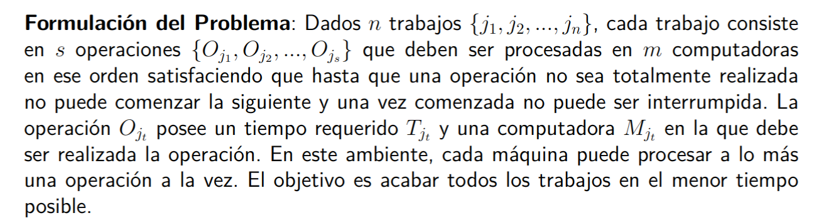

# Tareas

- Demostrar que el problema original:
    - Es NP-Hard
    - Es un caso particular del problema refactorizado
    - Investigar sobre algún/algunos algoritmos de aproximación para este y para el refactorizado

**Problema original:**

- Posibles casos particulares:
    - $s = 1$ ($s$ es la cantidad de operaciones por trabajo)
    - $m = 1$ ($m$ es la cantidad de computadoras)
    - $C_{i, j} = 0, \space \forall i, j$ (el tiempo de interrupción por cada operación es despreciable)
    - Los trabajos son añadidos durante la ejecución del algoritmo (online)